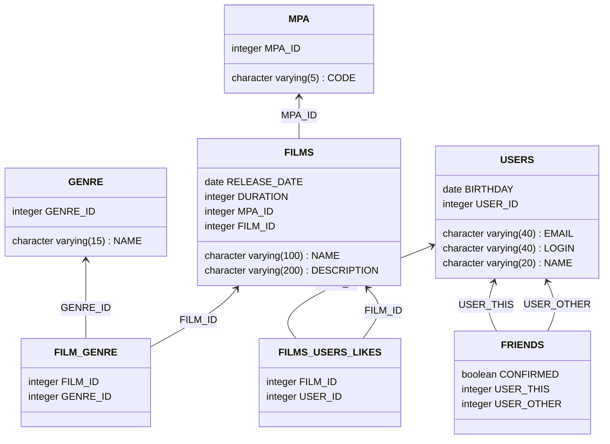

# java-filmorate
Repository for homework project filmorate.

filmorate database ER-diagram [mermaid](https://github.com/kmmins/java-filmorate/blob/add-database/assets/erd_filmorate.md):

Also see IDEA Ultimate auto-generated ER-diagram [erd_filmorate.png](https://github.com/kmmins/java-filmorate/blob/add-database/src/main/resources/erd_filmorate.png).

SQL-script here: [schema.sql](https://github.com/kmmins/java-filmorate/blob/add-database/src/main/resources/schema.sql).
